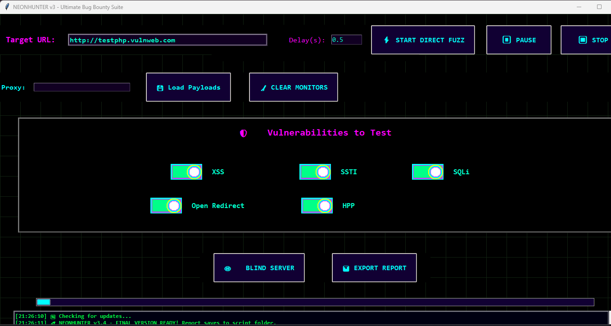

# NEONHUNTER v3.5 - Cyberpunk Bug Bounty Fuzzer Suite ⚡🏴‍☠️💀


Dive deep into the neon shadows of the web with **NEONHUNTER v3.5** — the ultimate GUI fuzzer built for real hunters! Glowing rainbow borders, glitch titles, neon toggles, live monitoring popups, blind server, screenshots, and HTML reports. Hunt XSS, SSTI, SQLi, Open Redirect, and HPP like a digital phantom. 🌌🔥🖤

## 🎯 Preview


*Futuristic interface with glowing neon elements and cyberpunk aesthetics*


## ⚡ Features
### 🎨 **VISUAL EXPERIENCE**
- **Neon Glow UI** - Rainbow borders, glitch effects, cyberpunk aesthetics
- **Live Animations** - Real-time visual feedback & status indicators
- **High Contrast Mode** - Optimized for better visibility
- **Icon-Based Navigation** - Intuitive interface with visual cues
- **Color Blind Mode** - Accessibility features included

### 🔍 **SCANNING CAPABILITIES**
- **10+ Vulnerability Types** - XSS, SQLi, SSTI, Open Redirect, HPP, LFI, Command Injection, XXE, SSRF, JWT
- **Concurrent Scanning** - Multi-threaded for maximum speed
- **Batch Processing** - Scan multiple targets automatically
- **Parameter Discovery** - Auto-detect parameters from target
- **Custom Payloads** - Import and use your own payload databases

### 📊 **REPORTING & ANALYSIS**
- **Professional HTML Reports** - Beautiful, detailed vulnerability reports
- **Multiple Export Formats** - HTML, CSV, JSON
- **Live Statistics** - Real-time performance metrics
- **Screenshot Capture** - Automatic PoC evidence collection
- **Executive Summaries** - Quick overview of findings

### 🛠️ **ADVANCED TOOLS**
- **Blind XSS Server** - Catch remote callbacks automatically
- **Session Management** - Maintain multiple HTTP sessions
- **Header Analyzer** - Check security headers compliance
- **SSL/TLS Checker** - Analyze SSL configuration
- **Proxy Support** - Route through proxies for anonymity
- **Request Replay** - Test and verify findings

### ⚙️ **PERFORMANCE**
- **Concurrency Control** - Adjust thread count (1-10)
- **Rate Limiting** - Prevent server overload
- **Auto-Save** - Never lose your scan progress
- **Quick/Deep Scan Modes** - Preset configurations
- **Batch Scanning** - Process target lists automatically

## 🚀 Quick Start

### Installation
```bash
# Clone the repository
git clone https://github.com/dkhacker707/NEONHUNTER.git
cd NEONHUNTER

# Install dependencies
pip install -r requirements.txt

# Run the application
python neonhunter.py