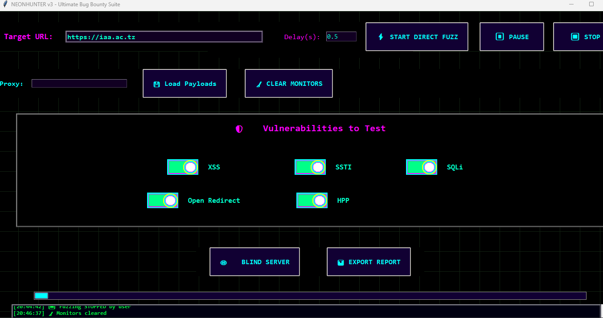

# NEONHUNTER v3 - Cyberpunk Bug Bounty Fuzzer Suite ⚡🏴‍☠️💀

Dive deep into the neon shadows of the web with **NEONHUNTER v3** — the ultimate GUI fuzzer built for real hunters! Glowing rainbow borders, glitch titles, neon toggles, live monitoring popups, blind server, screenshots, and HTML reports. Hunt XSS, SSTI, SQLi, Open Redirect, and HPP like a digital phantom. 🌌🔥🖤




## Features 🚀
- **Direct Fuzzing** → Blast payloads on any URL instantly 🧨
- **Neon Toggles** → Glow switches for vuln selection 💡
- **Live Monitors** → Real-time request & status popups 📡
- **Full Control** → Pause ⏸ / Stop ⏹ / Clear 🧹
- **Blind XSS Server** → Catch callbacks 👁️
- **Screenshots & Reports** → Auto-capture + HTML export 📸📊
- **Proxy & Custom Payloads** → Pro-level flexibility 🔧

## Installation 🛠️
```bash
git clone https://github.com/dkhacker707/NEON_HUNTER.git
cd NEON_HUNTER
pip install -r requirements.txt